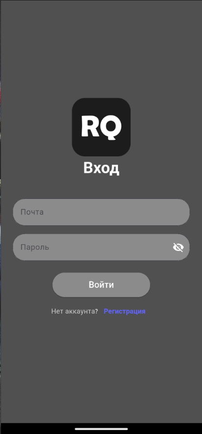
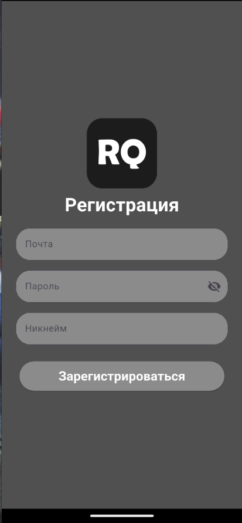
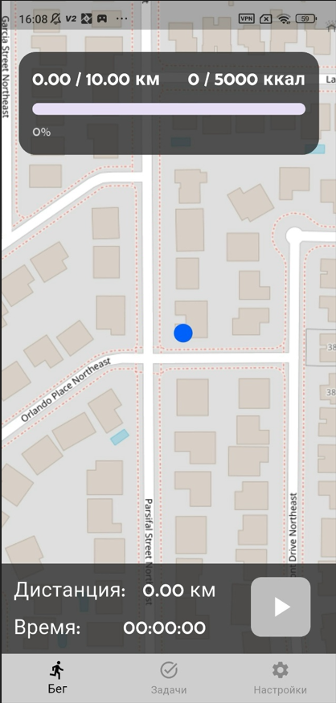
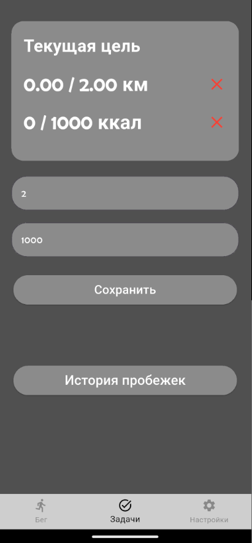
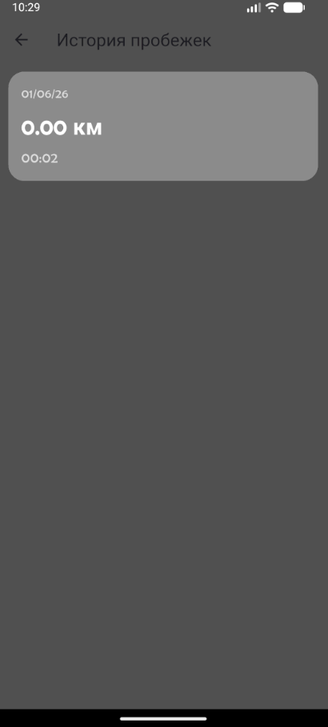
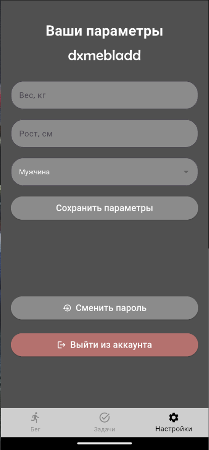

# RunQuest

<p align="center">
  
</p>

<h1 align="center">RunQuest</h1>

<p align="center">
  <strong>GPS-powered running tracker built with Flutter</strong>
</p>

<p align="center">
  
  
  
  
  
  
  
  
  
  
</p>

---

## 📖 Overview

**RunQuest** is a mobile fitness application built with Flutter and Firebase that helps users track running activities, monitor progress, and achieve personal fitness goals.

The application uses GPS tracking to calculate distance traveled, estimate calories burned, display routes on an interactive map, and store running history in the cloud.

# ✨ Features

- 🏃 Run Tracking
- Real-time GPS tracking
- Live route visualization
- Distance calculation
- Calories burned estimation
- Current location tracking
- Interactive map support

# 🎯 Goals

- Distance goals
- Calorie goals
- Goal progress monitoring
- Automatic goal completion tracking

# 📊 Statistics & History

- Running history
- Activity timestamps
- Distance statistics
- Calories statistics


# 🔐 Authentication

- User registration
- Firebase Authentication
- Password reset support

# ⚙️ User Settings

- Nickname support
- Height configuration
- Weight configuration
- Gender selection

# 📱 Screenshots

| Login | Registration | Main |
|------|------|------------|
|  |  |  |

| Tasks | History | Settings |
|------|-----------|----------|
|  |  |  |

---

# 🛠 Tech Stack

| Category | Tecnologies |
|----------|-------------|
| Framework | Flutter 3.9+ |
| Language | Dart |
|Authentication | Firebase Auth |
| Database | Cloud Firestore |
| Maps | Flutter Map |
| Map Data | OpenStreetMap |
| Location Services | Geolocator |
| State Management | Provider |
| Utilities | Intl |

---

# 🏗 Architecture

The project follows a service-based architecture with Provider state management.

```text 
lib/
├── screens/
│   ├── auth/
│   ├── home/
│   ├── history/
│   ├──main/
│   ├──tasks/
│   └── settings/
├── services/
│   ├── auth_service/
│   ├── firestore_service/
│   ├── location_service/
│   ├── run-logic/
└── main.dart
```

Main Components

- Authentication Service
- Firestore Service
- GPS Tracking Logic
- Goal Management System
- Running History Storage

---

# 📍 Location Tracking

RunQuest uses device GPS services to:

- Determine current position
- Track running routes
- Calculate traveled distance
- Location permission is requested when required for route tracking.

# 🚀 Getting Started

## Prerequisites

Before running the project make sure you have:

- Flutter SDK installed
- Android Studio or VS Code
- Firebase project configured

---

## ⚠ Required Firebase Configuration

The following files are not included in the repository:

```text
android/app/google-services.json
```

Generate Firebase configuration using:

```bash
flutterfire configure
```

# 📦 Installation

## 1. Clone the repository

```bash
git clone https://github.com/YOUR_USERNAME/runquest.git
cd runquest
```

## 2. Install dependencies

```bash
flutter pub get
```

## 3. Configure Firebase

```bash
flutterfire configure
```

## 4. Run the application

```bash
flutter run
```

# 🔨 Build Release APK

```bash
flutter build apk --release
```

# 🎯 Roadmap

- Weekly statistics
- Monthly statistics
- Achievement system
- Personal records
- Route sharing
- Social features
- Leaderboards

# 📄 License

This project was created for educational purposes.

No license is currently specified.
